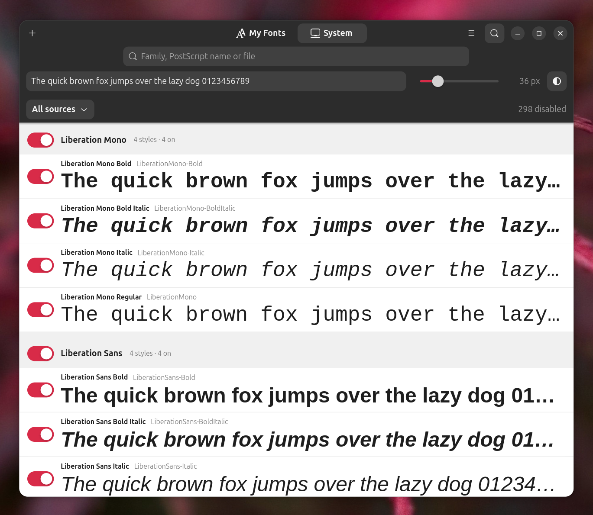

# Affinity Infinity

Run [Affinity by Canva](https://www.affinity.studio/) on Linux, as one AppImage.

What sets it apart:

- **Affinity updates itself.** Affinity is installed and updated from Canva's
  official installer, so you are not waiting for someone to repackage every
  release. Every start checks for a new version in a fraction of a second and
  offers to install it. This was tested with the Affinity releases published so
  far; a future release that changes its installer may need a fix here. See
  [Updates](#updates).
- **Live font manager.** Turn your own fonts on and off while Affinity is running:
  they appear in its font menu within a second, no restart needed, and a font you
  rebuild is reloaded in open documents. Take control of the font menu by hiding
  the hundreds of Linux system fonts you never use. See [Fonts](#fonts).
- **Docking panels work.** Studio panels can be dragged onto each other and back
  into the dock, as on Windows. Under stock Wine they stay loose, floating windows
  that clutter the screen; this build carries a Wine fix for it.

Nothing from Microsoft or Canva is redistributed:

- **Wine** is built by this project (`wine/`): Wine 11.12 with the Affinity patches
  from [Affinity-Wine-Builder](https://github.com/ryzendew/Affinity-Wine-Builder)
  (ElementalWarrior's work, d2d1 fixes, XDG portal file dialogs), a panel docking
  fix of our own, and [vkd3d-proton](https://github.com/HansKristian-Work/vkd3d-proton),
  built on Ubuntu 22.04 (glibc 2.35) so it runs on current Ubuntu, Fedora and friends.
- **The Windows environment** (Wine prefix with .NET Framework 4.8, VC++ 2022, core
  fonts) is built on your machine on first start, by winetricks from Microsoft's
  installers.
- **Affinity** is downloaded from `downloads.affinity.studio`; the MSI inside its
  installer is unpacked with Wine's `msiexec` (no installer GUI), and
  [AffinityPluginLoader + WineFix](https://github.com/noahc3/AffinityPluginLoader) are
  added on top to fix Wine-specific bugs.
- **The menu icon** is taken from your installed `Affinity.exe`.

Not affiliated with Canva. Affinity is a trademark of Canva.

## Install

```sh
curl -fsSL https://raw.githubusercontent.com/typedev/affinity-infinity/main/install.sh | bash
```

This puts the latest AppImage into `~/Applications/Affinity-Infinity-x86_64.AppImage`
(checksum-verified), adds **Affinity** to the applications menu and starts the setup:
one question, then one progress window while the Windows environment is built and
Affinity is downloaded (in parallel) and installed. Affinity opens when it is done.
The first setup takes about 10–15 minutes and downloads about 1.7 GB, once.

Requirements: x86_64, `fuse3` (preinstalled on desktop Ubuntu and Fedora; `libfuse2`
is **not** needed), `zenity` for the dialogs, a Vulkan-capable GPU driver and
`python3`. The **Affinity Fonts** window additionally needs Python bindings for
GTK 4.12+ and libadwaita 1.4+ (`python3-gi gir1.2-gtk-4.0 gir1.2-adw-1` on
Debian/Ubuntu; preinstalled on current GNOME desktops).

You can also download `Affinity-Infinity-<version>-x86_64.AppImage` from the
[releases](https://github.com/typedev/affinity-infinity/releases), make it executable and
start it: the first start does the same. If Gear Lever or AppImageLauncher integrates
the AppImage, no second menu entry is added.

Uninstall (asks before deleting Affinity, its settings and files):

```sh
curl -fsSL https://raw.githubusercontent.com/typedev/affinity-infinity/main/install.sh | bash -s -- --uninstall
```

## Fonts



Font management is the key feature of this build. On Linux, Affinity's font menu is
normally a dump of everything fontconfig knows (hundreds of DejaVu, Noto and other
system faces), and a font installed while Affinity runs does not show up until it is
restarted. **Affinity Fonts** (in the applications menu, or the `fonts --gui` command) fixes
both, while you keep working:

- **My Fonts** is your library. Drop font files or folders onto the window; they are
  referenced where they are, not copied. Switching a font or a whole family on or
  off shows up in Affinity's font menu **within about a second, without
  restarting Affinity**.
- **Live reload for type designers**: a font file rebuilt in place is reloaded, and
  open documents are redrawn with the new version. Keep several builds of a family
  in the library and switch between them.
- **System** lists the fonts Affinity gets from Linux (fontconfig), the Wine prefix
  and Wine itself. Disable the ones you never use to get a short, clean font menu
  (the screenshot above has 298 disabled). This takes effect at the next start of
  Affinity; **Restart Affinity** in the window closes it like its close button (it
  asks about unsaved documents) and starts it again. The fonts Affinity's interface
  needs (Tahoma, Arial, Wine's own) are locked.
- Every face has a sample line; text, size and white/black background are
  adjustable, and the search matches family, PostScript name or file.

The same from the command line:

```sh
A=~/Applications/Affinity-Infinity-x86_64.AppImage
$A fonts --gui                            # the Affinity Fonts window
$A fonts add ~/fonts/MyFamily/            # add (recursively) and enable
$A fonts list [--all]                     # state, PostScript name, family / style, file
$A fonts disable "My Family"              # by family or PostScript name, file or directory
$A fonts enable ~/fonts/MyFamily-v2/      # switch to another version
$A fonts disable --system "DejaVu Serif"  # a system font, from the next start
$A fonts remove --all                     # empty the library (files stay where they are)
$A restart                                # close Affinity properly and start it again
```

Affinity finds a font's file by its PostScript name, so two enabled files with the
same name would be used at random. Enabling a font therefore disables the other
library fonts with the same PostScript name (e.g. the previous build); a clash with
a system font is marked and the system one can be disabled.

How it works: under Wine every process has its own GDI font table, so fonts added
from outside are invisible to a running Affinity. The FontSync plugin
(`plugin/FontSync/FontSync.cs`, loaded by AffinityPluginLoader) runs inside
Affinity, adds and removes the enabled fonts with `AddFontResourceEx` and sends
`WM_FONTCHANGE`, on which Affinity rebuilds its font list. The plugin is compiled
on your machine with the prefix's .NET compiler. Fonts loaded when Affinity starts
cannot be removed from it, hence system fonts change at the next start: prefix fonts
are moved aside, and Linux fonts reach Wine through a folder of links to the enabled
ones (see `lib/fontsys.sh`).

## Use

Start **Affinity** from the applications menu; `.af`, `.afdesign`, `.afphoto`,
`.afpub` and `.aftemplate` files open in it. The menu entry also has **Check for
updates** and **Interface scale…** actions.

The AppImage takes the same commands as the CLI:

```sh
A=~/Applications/Affinity-Infinity-x86_64.AppImage
$A status              # versions, paths, DPI, last update check
$A dpi                 # configured / detected / effective interface DPI
$A dpi 192             # 200 % (96..480), or: dpi auto, dpi --gui
$A check               # exit 0 if a newer Affinity was published
$A update              # install it
$A desktop             # (re)create the menu entry
```

### Updates

- **Affinity**: every start checks for a new Affinity. A HEAD request (~0.2 s)
  compares the installer's ETag; only when it changed are the last 2 MB of the
  installer fetched to read its exact version. If it is newer, a dialog offers
  **Install**, **Later** or **Skip this version**. A failed check or update never
  prevents Affinity from starting (offline, the start is delayed by at most ~3 s).
- **Affinity Infinity itself**: at most once a day the latest GitHub release is
  checked; **Update** downloads the new AppImage, verifies its sha256, replaces the
  file in place and restarts. The AppImage also carries zsync update information for
  Gear Lever / AppImageUpdate.

### Interface scale (4K / HiDPI)

By default the DPI follows the desktop (`Xft.dpi`, GNOME scaling, `GDK_SCALE`);
`dpi N` or the menu action sets a fixed value. A DPI chosen in the older
Linux-Affinity-Installer AppImage (`~/.affinity-appimage-dpi.conf`) is imported.

### Rollback

The MSIs of the installed and the previous Affinity version are kept:

```sh
$A install --msi ~/.local/share/affinity-infinity/cache/Affinity-<version>.msi
```

## What is fixed, what is not

Handled automatically:

- WineFix (settings saving, Bézier preview, Wayland colour picker, startup crash) is
  loaded through AffinityPluginLoader; Wine's `d2d1` is replaced by WineFix's patched one.
- Affinity renders through vkd3d-proton (Direct3D 12 on Vulkan).
- The 64-bit font registry gets the regular faces of Arial, Tahoma etc. (without them
  the whole UI is drawn in Arial Italic).
- Fonts are managed while Affinity runs (see [Fonts](#fonts)).
- Studio panels dock and group: stock Wine hands a window drag to the window
  manager, so Affinity never sees where a panel is dropped. This build's Wine moves
  windows itself, as Windows does (`WINE_X11_WM_MOVE=1` restores the old behaviour).
- Affinity often hangs after its last window closes (settings are saved by then); a
  watchdog ends the Wine session ~20 s later instead of leaving gigabytes of memory in use.

Known issues:

- **Help and other web panels do not open**: they need Microsoft Edge WebView2, whose
  browser process crashes under Wine 11.0/11.12 and takes Affinity down with it. It is
  therefore not installed; `webview2` exists as an experiment only.
- Canva sign-in inside Affinity is likely affected by the same WebView2 limitation.

## Files and settings

| Path | Contents |
|---|---|
| `~/Applications/Affinity-Infinity-x86_64.AppImage` | the AppImage (via `install.sh`) |
| `~/.local/share/affinity-infinity/prefix/` | Wine prefix: Affinity, its settings, anything saved in its Windows folders |
| `~/.local/share/affinity-infinity/cache/` | Affinity MSIs, downloads, setup and msiexec logs |
| `~/.local/share/affinity-infinity/fonts/` | font library (`library.tsv`), the enabled fonts (`active.list`), disabled system fonts and their helpers |
| `~/.local/share/affinity-infinity/state.env` | installed versions, ETag, applied DPI, setup progress |
| `~/.config/affinity-infinity/config.env` | settings, see below |

`config.env` keys:

| Key | Values | Default |
|---|---|---|
| `DPI` | `auto` or `96`..`480` | `auto` |
| `AUTO_UPDATE_CHECK` | `1` / `0`: check for a new Affinity on start | `1` |
| `SELF_UPDATE_CHECK` | `1` / `0`: check for a new AppImage daily | `1` |
| `ICON` | `affinity` (from `Affinity.exe`) / `own` | `affinity` |

`AFFINITY_INFINITY_DATA` and `AFFINITY_INFINITY_CONFIG` override the two directories
(handy for trying things on a copy).

## Development

Layout: `bin/affinity-infinity` (CLI) and `lib/` (bash modules, two stdlib-only Python
helpers), `wine/` (Wine build), `packaging/` (tools and AppImage), `install.sh`.
Pinned inputs with checksums: `versions.env`, `wine/build.env`, `packaging/tools.env`.

```sh
wine/build-in-container.sh             # build Wine in podman/docker -> wine/out/
packaging/build-tools.sh               # winetricks + cabextract -> packaging/out/tools
packaging/build-appimage.sh wine/out/wine-11.12-ai1-x86_64.tar.xz   # -> packaging/out/
```

Running the CLI from the repository uses the Wine in `<data>/runtime/current`
(`setup --wine TARBALL` installs one) unless `AI_WINE_ROOT` points elsewhere, and needs
`AI_TOOLS_DIR=packaging/out/tools` for the prefix setup. Do not run it on the data
directory of an AppImage installation: a different Wine would update that prefix
back and forth. Use `AFFINITY_INFINITY_DATA=...` for experiments.

CI (`.github/workflows`):

- `wine.yml` builds Wine on Ubuntu 22.04 and publishes it as release
  `wine-<version>-ai<rev>` (on changes to `wine/`, or manually). Pin the result in
  `packaging/tools.env` (`WINE_TARBALL_URL`, `WINE_TARBALL_SHA256`).
- `appimage.yml` builds the AppImage; a `v*` tag publishes a release with the
  AppImage, `.sha256` and `.zsync`.
- `smoke.yml` runs the whole first-run recipe headless (prefix, Affinity install,
  checks) weekly, on pushes/PRs touching the app, or manually. Nothing is published.

Lint:

```sh
uv pip install --python .venv shellcheck-py
.venv/bin/shellcheck -x -P SCRIPTDIR bin/affinity-infinity lib/*.sh install.sh \
    packaging/*.sh packaging/AppRun wine/*.sh versions.env
```

## Credits

[ElementalWarrior](https://gitlab.winehq.org/ElementalWarrior/wine) and
[ryzendew](https://github.com/ryzendew/Affinity-Wine-Builder) (Wine patches),
[noahc3](https://github.com/noahc3/AffinityPluginLoader) (AffinityPluginLoader, WineFix),
[AffinityOnLinux](https://github.com/seapear/AffinityOnLinux) (guides),
[vkd3d-proton](https://github.com/HansKristian-Work/vkd3d-proton),
[winetricks](https://github.com/Winetricks/winetricks), and the Wine project.

## License

GPL-2.0-or-later (see `LICENSE`). Bundled and downloaded components keep their own
licenses; the AppImage carries them in `licenses/`.
